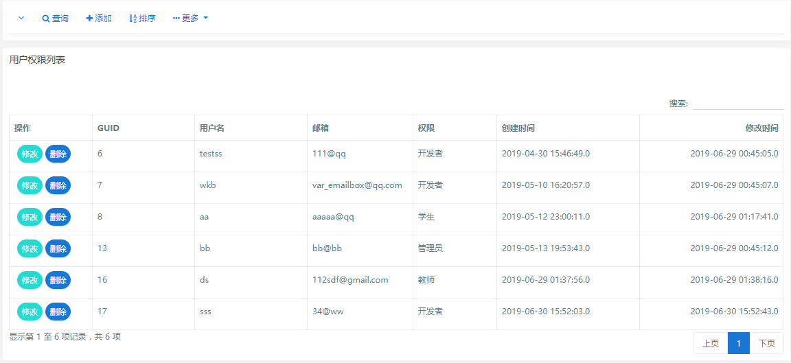
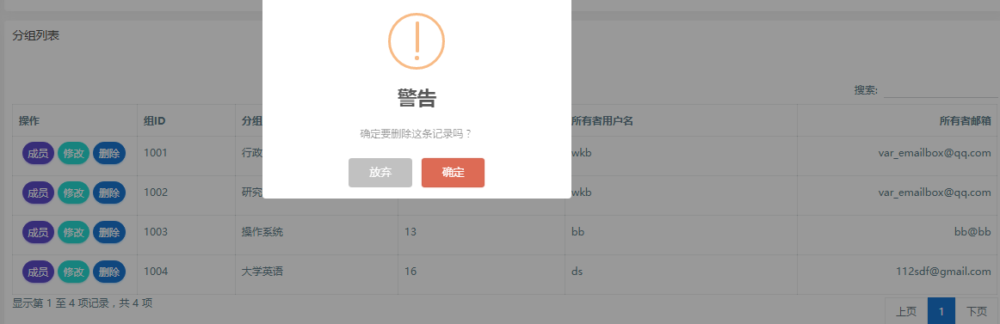
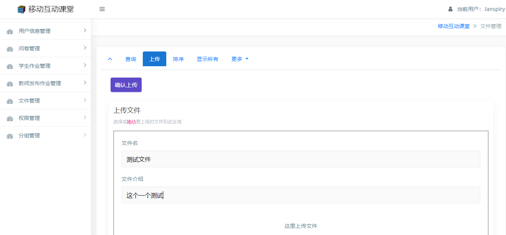
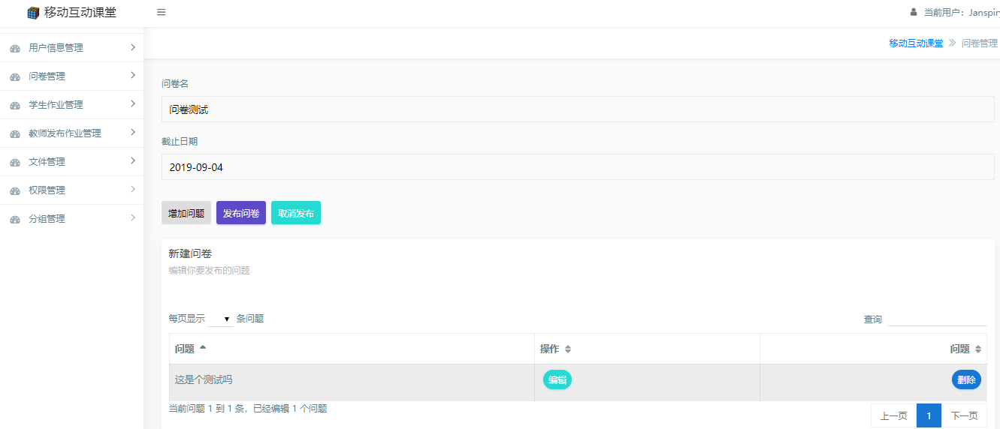
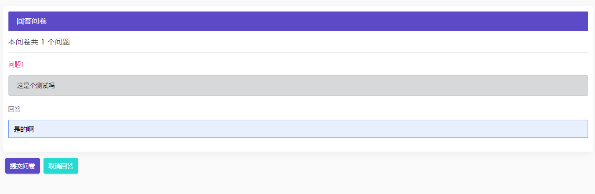
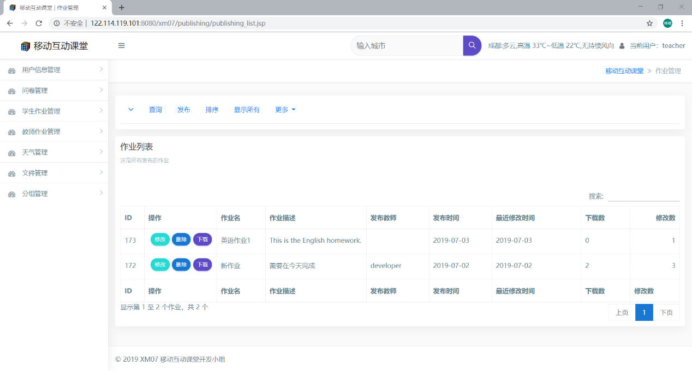
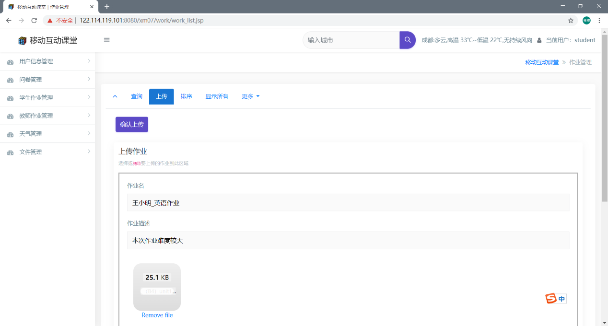

# MobileClass

【Java项目开发】

## **移动互动课堂系统**

### 功能介绍

####   用户管理  

| **添加** | 添加新用户，设置用户、个人基本信息及密码 |
| -------- | ---------------------------------------- |
| **删除** | 删除一个用户                             |
| **查询** | 根据ID、用户名、性别等查询用户           |
| **修改** | 修改用户、个人基本信息                   |
| **排序** | 根据ID、姓名、学号等对当前显示的用户排序 |
| **导出** | 导出当前的用户表，支持xlsx和cvs格式      |
| **打印** | 打印当前的用户表                         |
| **统计** | 统计用户的注册时间                       |

 

####  权限管理  

| **添加** | 添加新用户，并设置权限                       |
| -------- | -------------------------------------------- |
| **删除** | 删除一个用户                                 |
| **查询** | 根据ID、用户名、权限等查询用户               |
| **修改** | 修改用户权限信息                             |
| **排序** | 根据ID、邮箱、权限大小等对当前显示的用户排序 |
| **导出** | 导出当前的用户表，支持xlsx和cvs格式          |
| **打印** | 打印当前的用户表                             |
| **统计** | 统计用户的权限分布                           |

####  

####   分组管理  

| **添加** | 添加新的分组，设置组名、分组所有者，添加分组的成员 |
| -------- | -------------------------------------------------- |
| **删除** | 删除一个分组，删除分组的成员                       |
| **查询** | 根据组ID、组名、所有者查询分组                     |
| **修改** | 修改组名、所有者信息                               |
| **排序** | 根据组ID、所有者邮箱、组名等对当前显示的分组排序   |
| **导出** | 导出当前的分组表，支持xlsx和cvs格式                |
| **打印** | 打印当前的分组表                                   |
| **统计** | 统计分组的性别比例                                 |

####    

#### 文件管理  

| **删除** | 删除一个文件                                       |
| -------- | -------------------------------------------------- |
| **查询** | 根据文件名、上传者查询用户                         |
| **修改** | 修改文件名、文件介绍基本信息                       |
| **排序** | 根据上传时间、修改时间、下载数对当前显示的用户排序 |
| **导出** | 导出当前的文件列表，支持xlsx和csv格式              |
| **打印** | 打印当前的文件列表                                 |
| **统计** | 统计文件的上传时间                                 |

####    

#### 问卷发布管理  

| **添加** | 添加问卷，并设置问题                               |
| -------- | -------------------------------------------------- |
| **删除** | 删除一个问卷                                       |
| **查询** | 根据问卷名、发布者等查询用户                       |
| **修改** | 修改问卷名、截止时间等信息                         |
| **排序** | 根据截止时间、回答数、修改是等对当前显示的问卷排序 |
| **导出** | 导出当前的问卷列表，支持xlsx和csv格式              |
| **打印** | 打印当前的问卷列表                                 |
| **统计** | 统计问卷的发布时间                                 |

####   

####  

#### 问卷回答管理

| **添加** | 用户针对问卷添加回答                                         |
| -------- | ------------------------------------------------------------ |
| **删除** | 删除回答                                                     |
| **查询** | 根据用户名查询                                               |
| **修改** | 修改回答                                                     |
| **排序** | 根据回答次数、首次回答时间、最后修改时间等对当前显示的用户排序 |
| **导出** | 导出当前的用户表，支持xlsx和csv格式                          |
| **打印** | 打印当前的用户表                                             |
| **统计** | 统计用户的回答时间                                           |

####  

####   发布作业管理 

| **添加** | 发布作业，设置作业名、作业要求介绍                 |
| -------- | -------------------------------------------------- |
| **删除** | 删除一个已发布作业                                 |
| **查询** | 根据作业名、发布者查询用户                         |
| **修改** | 修改作业名、作业要求介绍基本信息                   |
| **排序** | 根据发布时间、修改时间、下载数对当前显示的用户排序 |
| **导出** | 导出当前的作业列表，支持xlsx和csv格式              |
| **打印** | 打印当前的作业列表                                 |
| **统计** | 统计作业的发布时间                                 |

####  

#### 提交作业管理  

| **添加** | 提交作业，设置作业名、作业备注说明                 | 添加问卷，并设置问题                               |
| -------- | -------------------------------------------------- | -------------------------------------------------- |
| **删除** | 删除一个已提交作业                                 | 删除一个问卷                                       |
| **查询** | 根据作业名、提交者查询用户                         | 根据问卷名、发布者等查询用户                       |
| **修改** | 修改作业名、作业备注说明基本信息                   | 修改问卷名、截止时间等信息                         |
| **排序** | 根据提交时间、修改时间、下载数对当前显示的用户排序 | 根据截止时间、回答数、修改是等对当前显示的问卷排序 |
| **导出** | 导出当前的作业列表，支持xlsx和csv格式              | 导出当前的问卷列表，支持xlsx和csv格式              |
| **打印** | 打印当前的作业列表                                 | 打印当前的问卷列表                                 |
| **统计** | 统计作业的发布时间                                 | 统计问卷的发布时间                                 |

####   

####  天气信息管理  

| **添加** | 增加一条天气信息                               |
| -------- | ---------------------------------------------- |
| **删除** | 删除一条天气信息                               |
| **查询** | 根据城市名称、id、天气类型、日期、气温查询     |
| **修改** | 修改天气信息                                   |
| **排序** | 根据日期、天气类型、气温等对当前显示的天气排序 |
| **导出** | 导出当前的天气信息表，支持xlsx和csv格式        |
| **打印** | 打印当前的天气信息表                           |
| **统计** | 统计城市的天气类型                             |

# 